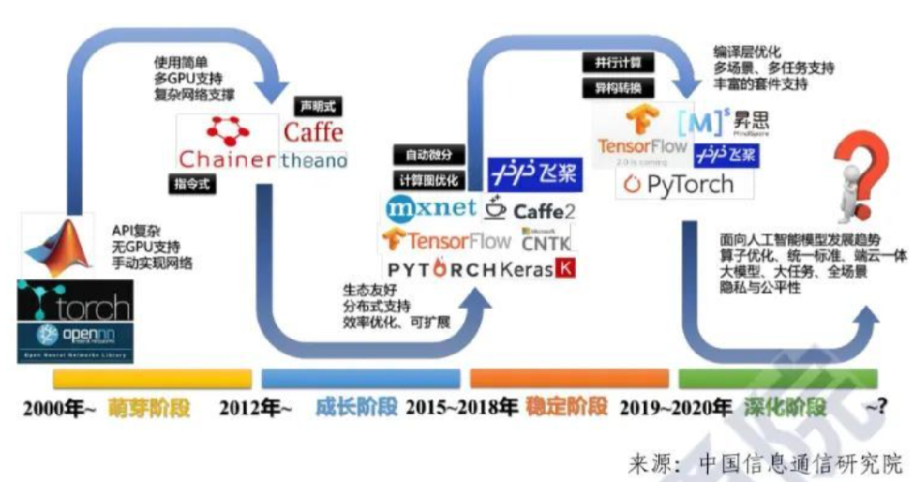
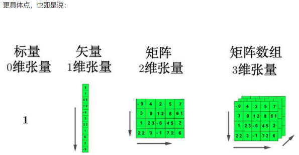
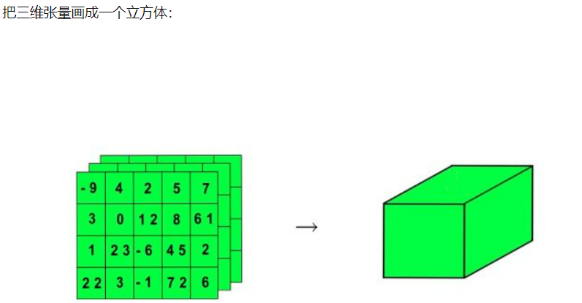
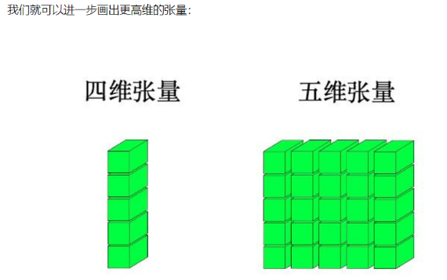
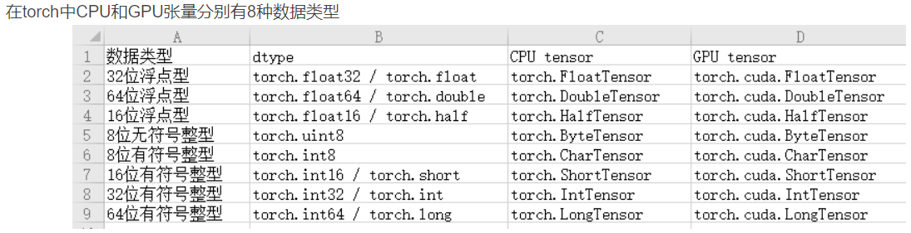
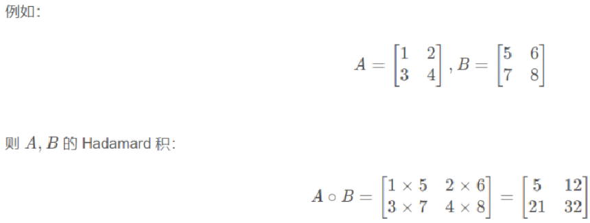
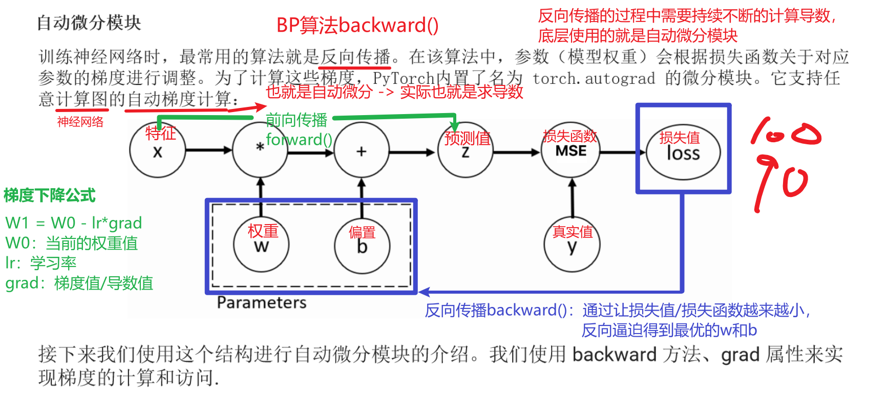
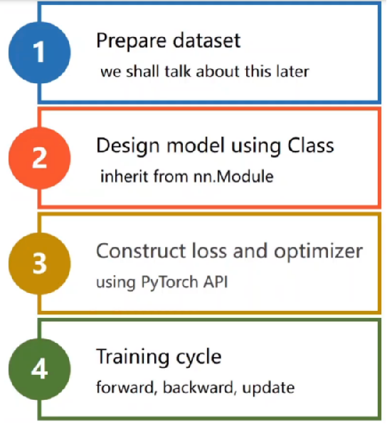
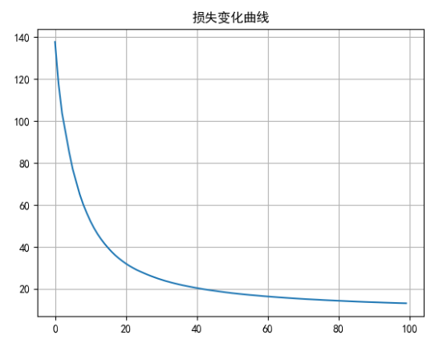
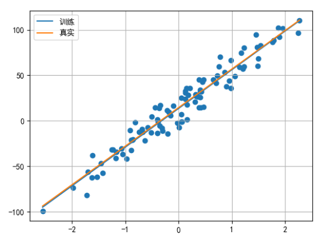

# PyTorch框架使用

## PyTorch框架简介

### 什么是PyTorch

> PyTorch是一个基于Python的科学计算包
>
> PyTorch安装
>
> ```sh
> pip install torch -i https://pypi.tuna.tsinghua.edu.cn/simple
> ```

- PyTorch一个基于Python语言的深度学习框架，它将数据封装成张量（Tensor）来进行处理。
- PyTorch提供了灵活且高效的工具，用于构建、训练和部署机器学习和深度学习模型。
- PyTorch广泛应用于学术研究和工业界，特别是在计算机视觉、自然语言处理、强化学习等领域。

### PyTorch特点

> **PyTorch与TensorFlow的比较**
>
> - **PyTorch与TensorFlow的区别**：PyTorch是基于动态图（动态计算图）的，而TensorFlow 1.x是基于静态计算图的（TensorFlow 2.x支持动态图）。这使得PyTorch在灵活性和调试方面优于TensorFlow，尤其是在研究和原型设计中。此外，PyTorch的API设计更加贴近Python，易于学习和使用。
> - **TensorFlow 2.x**（引入了Eager Execution）和PyTorch都支持动态图，但PyTorch因其更直观的编程模式和调试支持，在学术界和一些工业界应用中更为流行。

- **类似于NumPy的张量计算**
  - PyTorch中的基本数据结构是张量（Tensor），它与NumPy中的数组类似，但PyTorch的张量具有GPU加速的能力（通过CUDA（Compute Unified Device Architecture）是 NVIDIA 推出的一种并行计算平台和编程模型，它允许开发者利用 NVIDIA GPU 的强大计算能力来加速通用计算任务。），这使得深度学习模型能够高效地在GPU上运行。
- **自动微分系统**
  - PyTorch提供了强大的**自动微分**功能（`autograd`模块），能够自动计算模型中每个参数的梯度。
  - 自动微分使得梯度计算过程变得简洁和高效，并且支持复杂的模型和动态计算图。
- **深度学习库**
  - PyTorch提供了一个名为**torch.nn**的子模块，用于构建神经网络。它包括了大量的预构建的层（如全连接层、卷积层、循环神经网络层等），损失函数（如交叉熵、均方误差等），以及优化算法（如SGD、Adam等）。
  - `torch.nn.Module`是PyTorch中构建神经网络的基础类，用户可以通过继承该类来定义自己的神经网络架构。

- **动态计算图**
  - PyTorch使用动态计算图机制，允许在运行时构建和修改模型结构，具有更高的灵活性，适合于研究人员进行实验和模型调试。
- **GPU加速（CUDA支持）**
  - PyTorch提供对GPU的良好支持，能够在NVIDIA的CUDA设备上高效地进行计算。用户只需要将数据和模型转移到GPU上，PyTorch会自动优化计算过程。
  - 通过简单的`tensor.to(device)`方法，可以轻松地将模型和数据从CPU转移到GPU或从一个GPU转移到另一个GPU。
- **跨平台支持**
  - PyTorch支持在多种硬件平台（如CPU、GPU、TPU等）上运行，并且支持不同操作系统（如Linux、Windows、macOS）以及分布式计算环境（如多GPU、分布式训练）。

### PyTorch发展历史

- **Torch**

  Torch是最早的Torch框架，最初由Ronan Collobert、Clement Farabet等人开发。它是一个科学计算框架，提供了多维张量操作和科学计算工具。

- **Torch7**

  Torch7是Torch的一个后续版本，引入了Lua编程语言，并在深度学习领域取得了一定的成功。遗憾的是，随着pytorch的普及，Torch便不再维护，Torch7也就成为了Torch的最后一个版本。

- **Pytorch 0.1.0**

  在Torch的基础上，Facebook人工智能研究院（FAIR）于2016年发布了PyTorch的第一个版本，标志着PyTorch的正式诞生。

  初始版本的PyTorch主要基于Torch7，但引入了更加Pythonic的设计风格，使得深度学习模型的定义和调试更加直观和灵活。

- **Pytorch 0.2.0**

  该版本首次引入了动态图机制，使得用户能够在构建神经网络时更加灵活。作为Pytorch后期制胜tensorflow的关键机制，该版本象征着Pytorch进入了一个新的阶段。

- **Pytorch 1.0.0**

  2018年发布了Pytorch的首个稳定版本，引入了Eager模式简化了模型的构建和训练过程。

- **Pytorch 2.0**

  Pytorch2.0引入了torch.compile，可以支持对训练过程的加速，同时引入了TorchDynamo，主要替换torch.jit.trace和torch.jit.script。另外在这个版本中编译器性能大幅提升，分布式运行方面也做了一定的优化。



## 张量创建

~~~properties
掌握：
	什么是张量
	torch.tensor
	torch.linspace
	torch.rand
	torch.randint
	torch.manual_seed
	torch.zeros
	torch.ones
	张量对象.type(数据类型)
~~~


### 什么是张量

> 张量是PyTorch中的核心数据抽象

- PyTorch中的张量就是元素为同一种数据类型的多维矩阵，与NumPy数组类似。

- PyTorch中，张量以"类"的形式封装起来，对张量的一些运算、处理的方法（数值计算、矩阵操作、自动求导）被封装在类中。



==多个二维张量组成三维张量==



==多个三维张量组成四维张量==

==多个四维张量组成五维张量==



### 基本创建方式

> - 张量的数据类型有
>
>   
>
> - 张量中默认的数据类型是**float32(torch.FloatTensor)**

- torch.tensor(data=, dtype=) 根据指定数据创建张量

  ```python
  import torch  # 需要安装torch模块
  import numpy as np
  
  
  # 1. 创建张量标量
  data = torch.tensor(10)
  print(data)
  
  # 2. numpy 数组, 由于data为float64, 张量元素类型也是float64
  data = np.random.randn(2, 3)
  print(data,data.dtype)
  data = torch.tensor(data)
  print(data,data.dtype)
  
  
  # 3. 传递容器数据类型
  # 整数默认是int64
  data = torch.tensor([11,22,33])
  print(data,data.dtype)
  
  # 浮点数默认是float32
  data = torch.tensor([1.1, 2.2, 3.3])
  print(data,data.dtype)
  ```

- torch.Tensor(size=) 根据形状创建张量, 其也可用来创建指定数据的张量

  ```python
  # 创建2行3列的张量。元素类型默认是float32
  data_1 = torch.Tensor(2,3)
  print(data_1,data_1.dtype)
  
  # 注意：如果传递一个标量进去，实际是创建一个长度为5的向量
  data_1 = torch.Tensor(5)
  print(data_1, data_1.dtype)
  
  # 如果传递列表, 则创建包含指定元素的张量
  data_1 = torch.Tensor([5])
  print(data_1, data_1.dtype)
  
  data_1 = torch.Tensor([10, 20])
  print(data_1)
  ```

- torch.IntTensor()/torch.FloatTensor() 创建指定类型的张量

  ```python
  # 创建2行3列，数据类型为int32的张量
  data_2 = torch.IntTensor(2,3)
  print(data_2,data_2.dtype)
  
  # 可以通过传递列表，指定张量具体元素
  data_2 = torch.IntTensor([11,22,33])
  print(data_2, data_2.dtype)
  
  # 注意：创建张量时，如果传递的元素值类型与张量类型不匹配，会自动进行类型转换
  data_2 = torch.IntTensor([11.1,22.2,33.3])
  data_2
  
  # 3. 其他的类型
  data = torch.ShortTensor()  # int16
  data_2
  data = torch.LongTensor()   # int64
  data_2
  data = torch.FloatTensor()  # float32
  data_2
  data = torch.DoubleTensor() # float64
  data_2
  ```

### 线性和随机张量

- torch.arange(start=, end=, step=)：固定步长线性张量

- torch.linspace(start=, end=, steps=)：固定元素数线性张量

  ```python
  # arange区间是[start,end)左闭右开
  data_3 = torch.arange(start=1,end=10,step=2)
  print(data_3,data_3.dtype)
  
  # 生成一维张量。linspace区间是[start,end]左右都是闭区间。注意steps不表示步长，表示生成的元素个数
  data_3 = torch.linspace(start=1,end=10,steps=6)
  data_3
  ```
  
- torch.randn/rand(size=) 创建随机浮点类型张量

- torch.randint(low=, high=, size=) 创建随机整数类型张量 左闭右开

- torch.initial_seed() 和 torch.manual_seed(seed=) 随机种子设置

  ```python
  # 创建2行3列的随机值张量。元素值区间在[0,1)之间
  data_3 = torch.rand(2,3)
  data_3
  
  # 创建2行3列的随机值张量。元素值符合标准正态分布
  data_3 = torch.randn(2,3)
  data_3
  
  # 区间是左闭右开
  data_3 = torch.randint(low=1,high=10,size=(2,3))
  data_3
  
  # 查看随机数种子
  seed = torch.initial_seed()
  seed
  
  # 手动设置随机数种子
  # 设置以后，生成的随机数将会固定
  torch.manual_seed(4)
  data_3 = torch.randn(2,3)
  data_3
  ```

### 指定值张量

- torch.zeros(size=) 和 torch.zeros_like(input=) 创建全0张量

  ```python
  # 1. 创建指定形状2行3列，值全0张量
  data = torch.zeros(2, 3)
  print(data)
  
  # 2. 根据张量形状创建全0张量
  data = torch.zeros_like(data)
  print(data)
  ```

- torch.ones(size=) 和 torch.ones_like(input=) 创建全1张量

  ```python
  # 1. 创建指定形状全1张量
  data = torch.ones(2, 3)
  print(data)
  
  # 2. 根据张量形状创建全1张量
  data = torch.ones_like(data)
  print(data)
  ```

- torch.full(size=, fill_value=) 和 torch.full_like(input=, fill_value=) 创建全为指定值张量

  ```python
  # 创建全为指定值张量
  data_4 = torch.full(size=(2,3),fill_value=99)
  data_4
  
  # 根据张量形状创建指定值的张量
  data_5 = torch.full_like(data_4, 20)
  data_5
  ```

### 指定元素类型张量

- data.type(dtype=)

  ```python
  data = torch.full(size=(2,3),fill_value=10)
  print(data, data.dtype)
  
  # 神经网络中要求的数据类型就是float32
  data_1 = data.type(torch.float32)
  data_1
  
  # 转换为其他类型
  data_1 = data.type(torch.float64)
  data_1
  
  # 还有其他的写法
  data_1 = data.type(torch.FloatTensor)
  data_1
  
  data_1 = data.type(torch.DoubleTensor)
  data_1
  # data = data.type(torch.ShortTensor)
  # data = data.type(torch.IntTensor)
  # data = data.type(torch.LongTensor)
  # data = data.type(torch.FloatTensor)
  # data = data.type(dtype=torch.float16)
  ```

- data.half/float/double/short/int/long()

  ```python
  data = torch.full(size=(2,3),fill_value=10)
  print(data, data.dtype)
  
  # float16
  data_1 = data.half()
  data_1
  
  # float64
  data_1 = data.double() 
  data_1
  
  # int16
  data_1 = data.short()
  data_1
  ```

## 张量类型转换

### 张量转换为NumPy数组

- 使用 t.numpy() 函数可以将张量转换为 ndarray 数组，但是共享内存，可以使用copy函数避免共享。

  ```python
  import torch
  import numpy as np
  
  # 张量 转 numpy的ndarray
  t_1 = torch.tensor([11,22,33])
  print(t_1, type(t_1))
  
  # 共享内存
  arr_1 = t_1.numpy()
  print(arr_1, type(arr_1))
  
  # 可以在后面使用copy()，不共享内存
  arr_2 = t_1.numpy().copy()
  print(arr_2, type(arr_2))
  
  t_1[0] = 100
  print(f"t_1={t_1}，arr_1={arr_1}，arr_2={arr_2}")
  ```

### NumPy数组转换为张量

- 使用 torch.from_numpy(ndarray=) 可以将ndarray数组转换为 tensor张量，默认共享内存，使用copy函数避免共享。

- 使用 torch.tensor(data=) 可以将ndarray数组转换为tensor张量，默认不共享内存。

  ```python
  # numpy的ndarray 转 张量
  arr = np.array([11,22,33])
  print(arr,type(arr))
  
  # 共享变量
  t_1 = torch.from_numpy(arr)
  print(t_1, type(t_1))
  
  # 不共享变量
  t_2 = torch.tensor(arr)
  print(t_2, type(t_2))
  
  arr[0] = 99
  print(f"arr={arr}，t_1={t_1}，t_2={t_2}")
  ```

### 提取标量张量的数值

- 对于只有一个元素的张量，使用item()函数将该值从张量中提取出来

  ```python
  # 标量 和 张量 互转
  # 1- 标量 转 张量
  # t_1 = torch.tensor(24)
  t_1 = torch.tensor([24])
  print(t_1, type(t_1))
  
  
  # 2- 张量 转 标量
  value = t_1.item()
  print(value, type(value))
  
  # 注意：张量中只有一个值的时候才能够使用item()
  t_2 = torch.tensor([11,22])
  t_2
  
  values = t_2.item()
  values
  ```

## 张量数值计算

~~~properties
掌握：+ - * / @
~~~


### 基本运算

加减乘除取负号：

- +、-、*、/、-

- add(other=)、sub、mul、div、neg 

- `add_(other=)`、`sub_`、`mul_`、`div_`、`neg_`（其中带下划线的版本会修改原数据）

  ```python
  import torch
  
  # 1---- 基本运算 ----
  t1 = torch.tensor([[1,2,3],[4,5,6]])
  t1
  
  # 张量 和 数值运算，张量中每个元素都会和该数值进行运算
  t2 = t1 + 10
  t2
  
  t3 = t1 * 10
  t3
  
  # 运算函数
  # 不带下划线的函数，不会修改源数据
  # 下面的两种调用方式都行
  # t4 = torch.add(t3,10)
  t4 = t3.add(10)
  print(t3, "\n", t4)
  
  # 带下划线的函数，会修改源数据
  # 同时注意调用方式。只能这么调用
  t5 = t3.add_(10)
  print(t3, "\n", t5)
  
  # neg()、neg_()取反函数。正数变负数，负数变正数
  t1 = torch.tensor([[1, -2, 3], [4, -5, -6]])
  t1
  
  # 不会修改源数据
  t2 = t1.neg()
  print(t1, "\n", t2)
  
  # 会修改源数据
  t3 = t1.neg_()
  print(t1, "\n", t3)
  
  # 其他函数
  t1 = torch.tensor([[1, -2, 3], [4, -5, -6]])
  print(t1.sub(100)) # 减法
  print(t1.mul(100)) # 乘法
  print(t1.div(100)) # 除法
  ```

### 点乘运算

> 点乘（Hadamard）也称为元素级乘积，指的是相同形状的张量对应位置的元素相乘，使用mul和运算符 * 实现。
>
> 

```python
# 定义张量.   3行2列
t1 = torch.tensor([[1, 2], [3, 4], [5, 6]])

# 定义张量.   3行2列
t2 = torch.tensor([[7, 8], [9, 10], [11, 12]])
# t2 = torch.tensor([[7, 8], [9, 10]])
print(f't1: {t1}，\n t2: {t2}')


# 点乘
# 要求：两个张量的形状要相同
# 结果：对应位置元素相乘
t3 = t1 * t2
t3

# 点乘函数mul，推荐直接用*
t4 = t1.mul(t2)
t4
```

###  矩阵乘法运算

> 矩阵乘法运算要求第一个矩阵 shape: (n, m)，第二个矩阵 shape: (m, p), 两个矩阵点积运算 shape 为: (n, p)。

- 运算符 @ 用于进行两个矩阵的乘积运算

- torch.matmul(input=, other=) 

  ```python
  # 定义张量.   3行2列
  t1 = torch.tensor([[1, 2, 3], [4, 5, 6]])
  
  # 定义张量.   3行2列
  t2 = torch.tensor([[7, 8], [9, 10], [11, 12]])
  print(f't1: {t1}，\n t2: {t2}')
  
  # 要求：前一个矩阵的列数 = 后一个矩阵的行数
  t3 = t1 @ t2
  t3
  
  # 矩阵相乘函数matmul，推荐使用@
  # 下面两个写法都行
  t4 = t1.matmul(t2)
  # t4 = torch.matmul(t1,t2)
  t4
  ```

## 张量运算函数

- `tensor.mean(dim=)`:平均值

- `tensor.sum(dim=)`:求和。**掌握**

- `tensor.min/max(dim=)`:最小值/最大值

- `tensor.pow(exponent=)`:幂次方 $$x^n$$

- `tensor.sqrt()`:平方根

- `tensor.exp()`:指数 $$e^x$$

- `tensor.log()`:对数 以e为底

- ==dim=0按第0维（也就是行）计算，dim=1按第1维（也就是列）计算==

  ```python
  import torch
  
  # 定义张量, 浮点型.
  t1 = torch.tensor([[1, 2, 3], [4, 5, 6]], dtype=torch.float)
  
  print(t1, t1.shape)
  
  # 1- sum求和
  # dim=0，按列求和
  r1 = t1.sum(dim=0)
  r1
  
  # dim=1，按行求和
  r2 = t1.sum(dim=1)
  r2
  
  # dim不设置值，对所有元素求和
  r3 = t1.sum()
  r3
  
  
  # 2- 均值，元素数据类型必须是float，不能是整数
  t1 = torch.tensor([[1, 2, 3], [4, 5, 6]],dtype=torch.float32)
  # t1 = torch.tensor([[1, 2, 3], [4, 5, 6]],dtype=torch.int32)
  
  # r1 = t1.mean(dim=0)
  r1 = t1.mean(dim=1)
  r1
  
  
  # 3- 平方/立方/平方根/e的n次幂/对数
  t1 = torch.tensor([[1, 2, 3], [4, 5, 6]], dtype=torch.float)
  
  print(t1.pow(2)) # 平方
  print(t1.pow(3)) # 立方
  print(t1.sqrt()) # 开根号
  print(t1.exp()) # e的n次幂，元素作为幂使用
  print(t1.log()) # 以e为底求对数
  print(t1.log2()) # 以2为底的对数
  print(t1.log10()) # 以10为底的对数
  print(torch.log(t1) / torch.log(torch.tensor(3))) # 以3为底的对数（了解）
  ```

## 张量索引操作

~~~properties
掌握：范围索引	
~~~


> 我们在操作张量时，经常需要去获取某些元素就进行处理或者修改操作，在这里我们需要了解在torch中的索引操作。

```python
import torch

# 设置随机种子
torch.manual_seed(4)

# 创建张量
t1 = torch.randint(1, 10, (4,5))
t1

# 1---- 行列索引 ----
print(t1[0]) # 获取第一行
print("-"*30)
print(t1[:, 0]) # 获取第一列
print("-"*30)
print(t1[2,4]) # 获取 第3行和第5列限定的内容

# 2---- 列表索引 ----
# 需求1: 返回(0, 1), (1, 2)两个位置的元素
# [0,1]第0行、第1行
# [1,2]第1列、第2列
print(t1[[0,1], [1,2]])
print("-"*30)

# 需求2: 返回(0, 3), (2,4)两个位置的元素.
print(t1[[0,2], [3,4]])
print("-"*30)

# 需求3: 获取第0行的 第3列和第4列； 第2行的 第3列和第4列
# 共计: 4个元素
print(t1[[[0], [2]], [3,4]])

# 3---- 范围索引 ----
# 含头不含尾
# 需求1: 前3行, 前2列
print(t1[:3, :2])

# 需求2: 第2行到最后, 前2列
print(t1[2:, :2])

# 4---- 布尔索引 ----
# 需求1: 第3列中值大于等于5，对应行数据
print(t1[:, 2]>=5)
print("-"*30)

print(t1[torch.tensor([True, True, False, True])])
print("-"*30)

print(t1[t1[:, 2]>=5])

# 需求2: 第2行中值大于等于5，对应列数据
print(t1[2]>=5)
print("-"*30)

print(t1[:,torch.tensor([ True,  True, False,  True,  True])])
print("-"*30)

print(t1[:,t1[2]>=5])

# 5---- 多维索引 ----
t2 = torch.randint(1, 10, (3, 4, 5))
print(t2)
print("-"*30)

# 获取0轴上的第1个数据.
print(t2[0, :, :])
print("-"*30)

# 获取1轴上的第1个数据.
print(t2[:, 0, :])
print("-"*30)

# 获取2轴上的第1个数据.
print(t2[:, :, 0])
```

## 张量形状操作

~~~properties
掌握：
	reshape
	squeeze
	unsqueeze
	transpose
	permute
~~~


> 张量形状操作是指对张量的维度进行变换的一系列操作。
>
> 张量的形状则描述了每个维度上的元素数量。

###  reshape

> 保证张量数据个数不变的前提下改变维度

```python
import torch

data = torch.tensor([[10, 20, 30], [40, 50, 60]])
# 1. 使用 shape 属性或者 size 方法都可以获得张量的形状
print(data.shape, data.shape[0], data.shape[1])
print(data.size(), data.size(0), data.size(1)) # 效果同上

# 2. 使用 reshape 函数修改张量形状
new_data = data.reshape(1, 6)
print(new_data, new_data.shape)

new_data = data.reshape(1, -1)
print(new_data, new_data.shape)
```

### squeeze和unsqueeze

> squeeze：删除指定位置形状为1的维度，不指定位置则删除所有形状为1的维度，==降维==
>
> unsqueeze：在指定位置添加形状为1的维度，==升维==

```python
import torch

# squeeze和unsqueeze
# 定义张量, 5个元素
t1 = torch.tensor([1, 2, 3, 4, 5])
print(t1,t1.shape)

# unsqueeze增加形状为1的维度
t2 = t1.unsqueeze(dim=0) # 1行5列
print(t2,t2.shape)
print("-"*30)

t3 = t1.unsqueeze(dim=1) # 5行1列
print(t3,t3.shape)

# squeeze删除所有形状为1的维度
t4 = t3.squeeze()
print(t4,t4.shape)

# 重新定义多维, 且包含1的维度.
t5 = torch.randint(1, 10, (2, 1, 3, 1, 5))
print(t5,t5.shape)

# 不设置参数，表示删除所有为1的维度
t6 = t5.squeeze() # 形状[2, 3, 5]
print(t6, t6.shape)
print("-"*30)

# 可以通过dim精准删除哪个轴上的1的维度
t7 = t5.squeeze(dim=1) # 形状[2, 3, 1, 5]
print(t7, t7.shape)
```

### transpose和permute

> transpose：实现交换张量形状的指定维度, 例如: 一个张量的形状为 (2, 3, 4) ，把 3 和 4 进行交换, 将张量的形状变为 (2, 4, 3) 
>
> permute：一次交换更多的维度

```python
t1 = torch.randint(1,10,(2,3,5))
print(t1, t1.shape)

# 需求1: 交换0轴 和 1轴.  (2, 3, 5) -> (3, 2, 5)
"""
    transpose（参数1，参数2）：注意每次只能交换两个维度的位置
        参数1、参数2 表示的是要交换哪几个轴的位置。参数传递顺序无所谓
"""
# 下面两个写法效果一样
# t2 = t1.transpose(dim0=1,dim1=0)
t2 = t1.transpose(dim0=0,dim1=1)
print(t2, t2.shape)
print("-"*30)


# 需求2: 从 (2, 3, 5) -> (5, 2, 3)
"""
    permute(dims)：同一时刻可以交换多个维度的位置。参数中传递的是维度顺序
"""
t3 = t1.permute(dims=[2,0,1])
print(t3, t3.shape)
```

## 张量拼接操作

> 张量拼接操作用于组合来自不同来源或经过不同处理的数据。

### cat/concat

> 沿着现有维度连接一系列张量。所有输入张量除了指定的拼接维度外，其他维度必须一样。

```python
"""
    cat：
        1- 不能修改张量的维度个数。例如：不能将2维变3维
        2- 除了拼接的维度以外，其他维度必须相同
"""
t1 = torch.randint(1,10,size=(2,3))
t2 = torch.randint(1,10,size=(2,3))
print(t1,t1.shape)
print(t2,t2.shape)


cat_1 = torch.cat([t1,t2],dim=0)
print(cat_1,cat_1.shape)

cat_2 = torch.cat([t1,t2],dim=1)
print(cat_2,cat_2.shape)


# 不能将2维变3维
# torch.cat([t1,t2],dim=2)


t1 = torch.randint(1,10,size=(2,3))
# 除了拼接的维度以外，其他维度必须相同
t2 = torch.randint(1,10,size=(5,3))
# t2 = torch.randint(1,10,size=(2,4))
print(t1,t1.shape)
print(t2,t2.shape)

cat_1 = torch.cat([t1,t2],dim=0)
print(cat_1,cat_1.shape)
```

### stack

> 在一个新的维度上连接一系列张量，这会增加一个新维度，并且所有输入张量的形状必须完全相同。

```python
import torch

"""
    stack：
        1- 两个拼接的张量形状必须完全一样
        2- 会产生新维度，在新维度上进行拼接操作
"""
t1 = torch.randint(1,10,size=(5,6))
t2 = torch.randint(1,10,size=(5,6))
print(t1,t1.shape)
print(t2,t2.shape)

stack_1 = torch.stack([t1,t2],dim=0)
print(stack_1,stack_1.shape) # [2,5,6]

stack_2 = torch.stack([t1,t2],dim=1)
print(stack_2.shape) # [5,2,6]

stack_3 = torch.stack([t1,t2],dim=2)
print(stack_3.shape) # [5,6,2]
```

## 自动微分模块【掌握】

> 自动微分就是自动计算梯度值,也就是计算导数。

- 什么是梯度
  - 对函数求导的值就是梯度
- 什么是梯度下降法
  - 是一种求最优梯度值的方法,使得损失函数的值最小
- 梯度经典语录
  - **对函数求导得到的值就是梯度** （在数值上的理解）
    - 在某一个点上，对函数求导得到的值就是该点的梯度
    - 没有点就无法求导,没有梯度
  - **梯度就是下山最快的方向** （在方向上理解)
  - **在平面内，梯度就是某一点上的斜率** 
    - y = 2x^2 某一点x=1的梯度，就是这一点上的斜率
  - **反向传播传播的是梯度**
    - 反向传播利用链式法则不断的从后向前求导，求出来的值就是梯度，所以大家都经常说反向传播传播的是梯度
  - **链式法则中，梯度相乘，就是传说中的梯度传播**

训练神经网络时，最常用的算法就是反向传播。在该算法中，参数（模型权重）会根据损失函数关于对应参数的梯度进行调整。为了计算这些梯度，PyTorch内置了名为 torch.autograd 的微分模块。它支持任意计算图的自动梯度计算：



接下来我们使用这个结构进行自动微分模块的介绍，我们使用 backward 方法、grad 属性来实现梯度的计算和访问。

### 梯度基本计算

> - ==pytorch不支持向量张量对向量张量的求导,只支持标量张量对向量张量的求导==
>   - 简单理解就是损失值需要是标量，因为要对权重求导
> - 计算梯度: `y.backward()`, y是一个标量张量
> - 获取x点的梯度值: `x.grad`, 会累加上一次的梯度值

- 标量张量梯度计算_单轮

  ```python
  # 演示反向传播
  
  import torch
  
  if __name__ == '__main__':
      # 1- 初始化w0的值
      """
          参数解释：
              requires_grad：是否允许计算梯度值，也就是是否允许求导。比如设置为True
              dtype：数据类型。如果该参数需要求导，那么数据类型必须是小数
      """
      w0 = torch.tensor(10,requires_grad=True,dtype=torch.float32)
  
      # 2- 自定义损失函数：下面的公式想怎么写就怎么写。loss=2w²
      loss = 2*w0**2
  
      # 3- 进行反向传播
      loss.sum().backward()
  
      # 4- 带入梯度下降公式，得到更新后的权重值w
      lr = 0.1
      w1 = w0.data - lr*w0.grad
      print(f"反向传播更新后的权重值为：{w1}")
  ```
  
- 标量张量梯度计算_多轮

  ```python
  
  import torch
  
  if __name__ == '__main__':
      # 1- 初始化权重值
      x = torch.tensor(20,requires_grad=True,dtype=torch.float32)
  
      # 进行多次梯度的更新
      epochs = 100
      for epoch in range(epochs):
          # 2- 定义损失函数
          y = 2*x**2
  
          # 3- 梯度清零：因为Pytorch会对梯度值进行累加
          if x.grad is not None:
              x.grad.zero_()
  
          # 4- 反向传播
          # 这里可以用sum()或者mean()。常用的是sum()
          y.sum().backward()
  
          # 5- 更新梯度值
          # W1 = W0 - lr*grad
          old_x = x.data  # 原始的权重值
          lr = 0.01        # 学习率
          grad = x.grad   # 自动微分计算得到的梯度值。也就是导数值
  
          x.data = x.data - lr*grad
  
          print(f"第{epoch+1}次计算，原始的权重值{old_x}，更新后的权重值{x.data}")
  ```

### 梯度计算注意点【熟悉】

- 不能将自动微分的张量转换成numpy数组，会发生报错，可以通过detach()方法实现

  ```python
  import torch
  
  if __name__ == '__main__':
      t1 = torch.tensor(20,requires_grad=True,dtype=torch.float32)
  
      d_2 = t1.data
      print(d_2)
      print(d_2.requires_grad)
      print(d_2.numpy())
  
      # 查看基础信息
      # print(t1)
      # print(type(t1))
      # print(t1.requires_grad)
  
      # 如果设置requires_grad=True有使用限制。无法直接转成numpy中的ndarray数组
      # arr_1 = t1.numpy()
      # print(arr_1)
  
      # 如果还想转成numpy中的ndarray数组。需要使用detach()
      """
          使用了detach()
              1- 能够转成numpy中的ndarray数组
              2- 分离后的新张量与原始的张量之间共享内存，但是内存地址不同
              
          扩展：
              还可以通过 张量对象.data 进行分离。
      """
      d_1:torch.Tensor = t1.detach()
      arr_1 = d_1.numpy()
      print(d_1)
      print(d_1.requires_grad) # False
      print(arr_1)
  
      # 分离后的新张量与原始的张量之间共享内存，但是内存地址不同
      print(id(t1))
      print(id(d_1))
      print(t1)
      print(d_1)
      print("-"*30)
  
      d_1.add_(1000)
  
      print(id(t1))
      print(id(d_1))
      print(t1)
      print(d_1)
  ```

### 自动微分模块应用【了解】

演示前向传播和反向传播的过程

```python
import torch

if __name__ == '__main__':
    # --------------- 前向传播 --------------- 
    # 1- 样本数据准备
    # 2条样本，每条样本有5个特征
    x = torch.ones(2,5)

    # 2- 样本数据的真实值
    y = torch.zeros(2,3)

    # 3- 初始化w权重和b偏置
    w = torch.randn(5,3,requires_grad=True,dtype=torch.float32)
    b = torch.randn(3,requires_grad=True,dtype=torch.float32)

    # 4- 前向传播计算得到预测值
    z = x @ w + b

    # 5- 定义损失函数
    loss_fn = torch.nn.MSELoss()

    # 6- 计算损失值
    loss_value = loss_fn(z,y)
    print(f"损失值是：{loss_value}")

    # --------------- 反向传播 --------------- 
    # 7- 反向传播
    loss_value.sum().backward()

    # 8- 更新梯度值，也就是要更新w和b
    print(f"w的梯度是{w.grad}")
    print(f"b的梯度是{b.grad}")
```


## PyTorch模拟线性回归模型【了解】

我们使用 PyTorch 的各个组件来构建线性回归模型。在pytorch中进行模型构建的整个流程一般分为四个步骤：

- 准备训练集数据
- 构建要使用的模型
- 设置损失函数和优化器
- 模型训练



要使用的API：

- 使用 PyTorch 的 nn.MSELoss() 代替平方损失函数
- 使用 PyTorch 的 data.DataLoader 代替数据加载器
- 使用 PyTorch 的 optim.SGD 代替优化器
- 使用 PyTorch 的 nn.Linear 代替假设函数

```python
import torch
from torch import nn
from torch import optim # 优化器
from torch.utils.data import TensorDataset  # 张量数据集
from torch.utils.data import DataLoader # 数据加载器
from sklearn.datasets import make_regression # 产生随机的测试数据
import matplotlib.pyplot as plt
plt.rcParams['font.sans-serif'] = ['SimHei']    # 用来正常显示中文标签
plt.rcParams['axes.unicode_minus'] = False      # 用来正常显示负号

def create_dataset():
    # 为什么这里能够返回样本真实的斜率coef？
    # 因为这些样本是程序自动给我们生成的，那么程序它本身肯定是知道斜率是多少
    x,y,coef = make_regression(
        n_samples=100,  # 生成的样本数据条数
        n_features=1,   # 每条样本的特征个数
        n_targets=1,    # 每条样本的目标值个数
        bias=10.14,     # 线性方程中的截距，也就是b
        coef=True,      # 是否要返回斜率，也就是w
        noise=10,       # 噪声，让数据稍微分散一些
        shuffle=True,   # 样本数据是否打散
        random_state=1014# 随机数种子
    )

    # print(f"x-->{x},shape-->{x.shape},type-->{type(x)}")
    # print(f"y-->{y},shape-->{y.shape},type-->{type(y)}")
    # print(f"coef-->{coef},type-->{type(coef)}")

    # 步骤：不管是什么数据类型 -> 张量
    x = torch.tensor(x,dtype=torch.float32)
    y = torch.tensor(y,dtype=torch.float32)

    return x,y,coef

def train_model(x,y,coef):
    # 1- 构造得到数据加载器
    # 1.1- 将特征和目标值进行合并
    dataset = TensorDataset(x,y)

    # 1.2- 得到数据加载器
    """
        作用：为了防止内存溢出，也就是避免数据量过大导致内存不够
        batch_size：每次给到模型训练的数据条数
        shuffle：是否要对数据进行打散，防止样本不均衡
    """
    dataloader = DataLoader(dataset,batch_size=16,shuffle=True)

    # 2- 定义对象
    # 2.1- 创建线性模型
    """
        in_features：输入的特征个数，也就是输入层的神经元个数
        out_features：输出的特征个数，也就是隐藏层的神经元个数
        bias：是否要对偏置进行计算
    """
    model = nn.Linear(in_features=1,out_features=1,bias=True)

    # 2.2- 损失函数对象
    criterion = nn.MSELoss()

    # 2.3- 优化器
    """
        作用：优化器负责自动进行梯度更新计算  W1 = W0 - lr*grad
        params：优化器对哪些参数进行梯度更新，实际就是w和b
        lr：学习率
    """
    optimizer = optim.SGD(params=model.parameters(),lr=0.01)

    # 3- 模型训练
    epochs = 100 # 总共对全量样本训练多少轮次
    loss_list = [] # 用来记录每个轮次得到的损失值

    for epoch in range(epochs):

        # 每个轮次得到的损失值
        total_loss_value = 0.0
        # 每个轮次训练的样本数据条数
        total_sample_cnt = 0

        for x_train,y_train in dataloader:
            # 预测
            y_predict = model(x_train)
            # print(f"y_train-->{y_train.shape}")
            # print(f"y_predict-->{y_predict.shape}")

            # 计算损失值
            loss_value = criterion(y_predict,y_train.reshape(-1,1))

            # 记录下损失值和样本数据条数
            total_loss_value += loss_value.item() * len(x_train)
            total_sample_cnt += len(x_train)

            # 反向传播（下面是固定代码）
            # 梯度清零
            optimizer.zero_grad()
            # 反向传播
            loss_value.sum().backward()
            # 更新权重和偏置：也就是自动计算W1 = W0 - lr*grad
            optimizer.step()

        avg_loss_value = total_loss_value/total_sample_cnt
        loss_list.append(avg_loss_value)
        print(f"第{epoch+1}次训练，平均损失{avg_loss_value}")

    # 深度学习中不用将整个算法模型进行保存，只需要保存关键参数即可
    print("训练好的模型参数信息",model.state_dict())

    # 4- 可视化展示
    # 4.1- 循环轮次epochs与损失值的关系
    plt.plot(range(epochs), loss_list)
    plt.xlabel("循环轮次epochs")
    plt.ylabel("损失值")
    plt.title("循环轮次epochs与损失值的关系")
    plt.grid()
    plt.show()

    # 4.2- 预测和真实结果对比
    """
        1- 展示100条样本的散点图：横轴特征x，纵轴目标y
        2- 真实线性回归曲线图
        3- 预测线性回归曲线图
    """
    plt.scatter(x, y)

    axis_x = torch.linspace(x.min(), x.max(), 1000)
    # 真实线性回归曲线图
    true_fn_torch = torch.tensor([tmp_x * coef + 10.14 for tmp_x in axis_x])

    # 预测线性回归曲线图
    pred_fn_torch = torch.tensor([tmp_x * model.weight.detach() + model.bias.detach() for tmp_x in axis_x])

    plt.plot(axis_x, true_fn_torch, label="真实值", color="red")
    plt.plot(axis_x, pred_fn_torch, label="预测值", color="blue")

    plt.grid()
    plt.legend()
    plt.title("真实和预测的对比")
    plt.show()


if __name__ == '__main__':
    # 1- 准备训练集数据
    x,y,coef = create_dataset()

    # 2- 模型训练
    train_model(x,y,coef)
```





​	